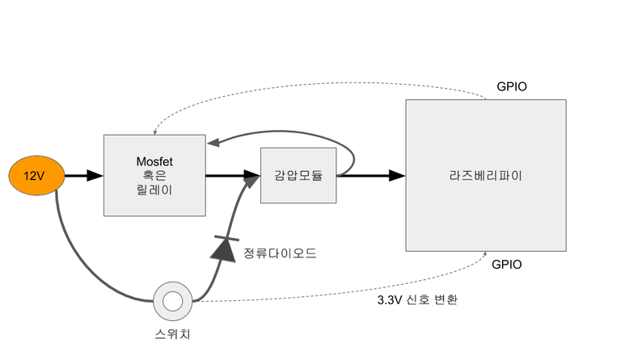
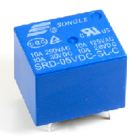
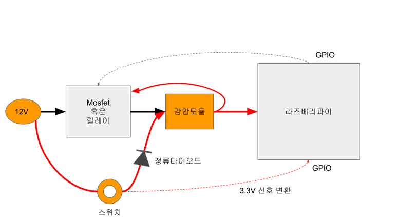
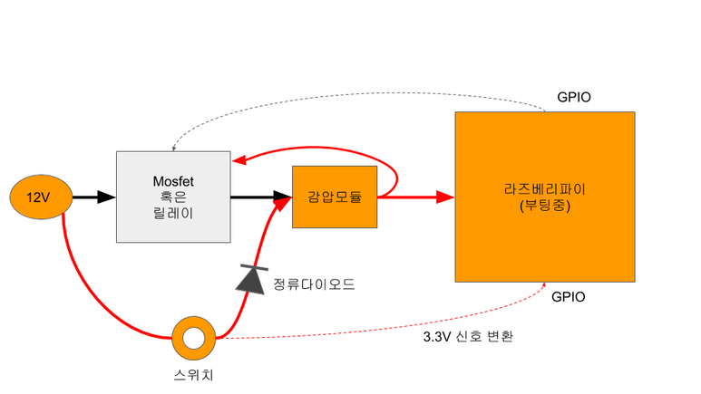
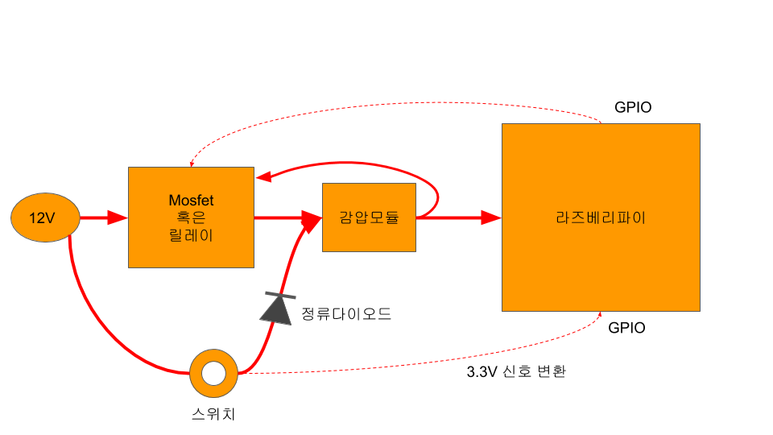
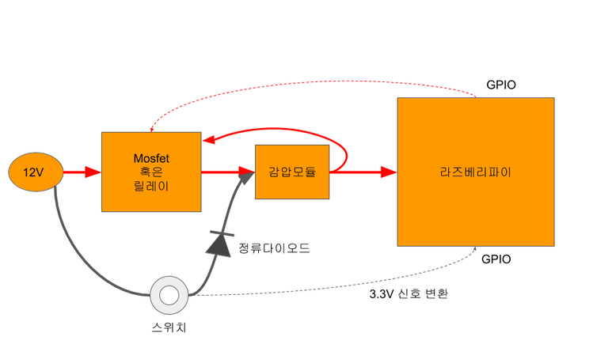
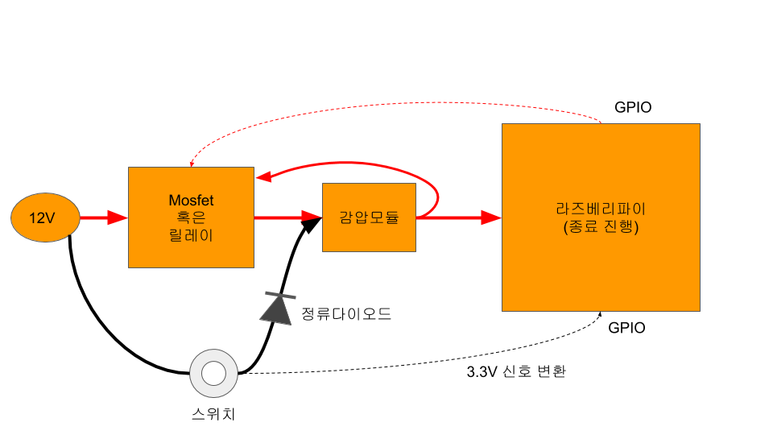
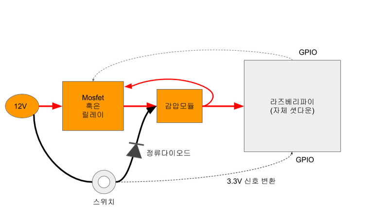
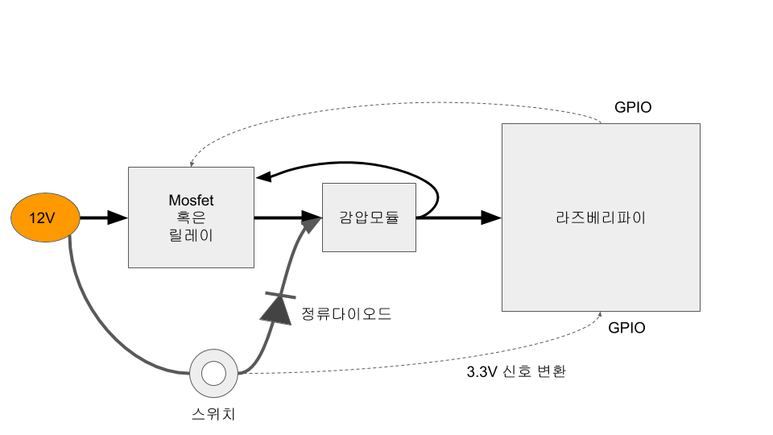
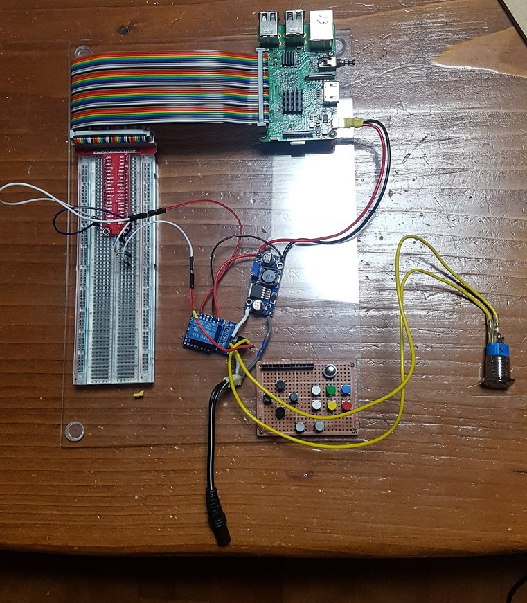

라즈베리파이와 같은 Linux 기반의 SBC들은 정상적인 종료 절차를 밟지 않고 임의로 전원을 차단해 버리면 파일 시스템에 손상을 입는 경우가 많다.
때문에 종료 명령을 내린 이후, 셧다운 절차가 다 끝나기를 기다렸다가 전원을 끊어야 한다.
종료 명령을 내리기 위해 커맨드를 호출하는 것도 귀찮지만, 종료되기까지 기다리는 것도 지루하다.
특히 게임기와 같이 자주 껐다 켰다 하는 기기의 경우엔 더더욱 그러하다.

이런 이유로 safety shutdown 회로를 만들어 넣게 되었다.
기본적으로 12V 입력을 받아서 2군데로 나눈 다음, LCD로는 12V를 그대로 보내고 5V로 감압해서 라즈베리파이로 공급하게 할 것이다.

이때 개인적으로 중점을 둔 몇가지 사안이 있다.

첫째, 최대한 회로를 단순하게 만들 것.
둘째, 전원이 끊기면 미세전류조차 없이 완전히 전원선을 단선시켜 버릴 것.
셋째, 전력 소모를 최소화 할 것.

이런 것들음 감안해서 개인적으로 구상한 회로는 다음과 같다.
몇가지 모듈들을 배치해서 단순하게 결선만 하면 된다.



이런 종류의 스위칭 회로를 만들 때 가장 고민되는 것 중 하나가...
바로 mosfet을 쓸 것인가 relay를 쓸 것인가이다.

간단히 설명하자면... 릴레이는 정액제, 모스펫은 종량제라 생각하면 된다.
릴레이는 동작을 위해 기본적으로 소모하게 되는 전력이 좀 큰 편이다.
하지만 딱 그 정도 전력만 소모할 뿐, 일단 스위칭이 이루어지면 이 릴레이를 통해 아무리 고전류를 흘려도 추가로 소모되는 전력은 없다.
반면 모스펫은 릴레이처럼 스위칭 자체를 위해 소모되는 전력은 거의 없지만...
대신 모스펫을 통과해 흐르는 전류는 일정량의 손실이 발생한다.
10W급 이상 되는 전원을 스위칭하는 데에는 보통 97% 효율을 가진 모스펫을 많이 쓰는데...
이는 다시 말해 3% 정도의 전류가 손실된다는 의미이다.
손쉴되어 아까운 것도 문제지만, 이 손실분이 열로 변환된다는 것도 문제다.
이로 인해 가열된 모스펫은 더더욱 효율을 떨어뜨리기 때문이다.

간단히 계산해 보자면...
일반적으로 많이 쓰는 릴레이는 5V 기준으로 72mA 정도를 소모한다.
(흔하게 구할 수 있는 DIY용 릴레이 모듈은 대부분 이런 릴레이를 사용한다.)



모스펫의 경우엔 3% 정도 손실이 있다고 가정한다면 12W 전원을 기준으로 할 때, 약 70~80mA 정도가 소모된다.
12W 정도에선 둘 사이의 차이가 아주 크진 않다.
참고로 12W 정도라면... 라즈베리파이3B와 10인치 급 액정을 연결해서 2D 위주의 에뮬 게임을 돌리는 수준이라 보면 된다.
즉, 10인치를 넘어서, 14인치급이 되면 20W 가까운 전력을 필요로 하기에, 모스펫의 경우엔 140mA 가 손실되지만, 릴레이의 경우엔 여전히 72mA만 소모할 뿐이다.
사실 이 릴레이도 게임기 제작시엔 오버스펙이라 할 수 있다. 게임기는 220V처럼 고전력을 사용하는 것이 아니라 대체로 사용 전력 수준이 12V 2~3A 정도 수준에 머무른다. 때문에 더 작은 릴레이를 사용할 수 있고, 이 경우 릴레이의 소모전력을 더 줄일 수 있다.

결론적으로 말하자면... 특별히 더 고효율의 고가 모스펫을 쓰지 않는 이상... 휴대용이 아닌 바탑에선 릴레이를 쓰는 것이 조금 더 유리하다.
첨언하자면... 라즈베리파이의 GPIO가 3.3V이기 때문에 릴레이 모듈을 구입할 땐 3.3V 신호 입력을 받을 수 있는 모델로 구매하면 회로 구성이 좀 더 간단해진다. (많은 모듈들이 3.3V와 5V 신호를 모두 인식하지만, 아두이노용이라면서 판매되는 모듈들 중엔 오직 5V 신호만 인식하는 것도 있으니 잘 체크해 봐야 한다.)

사설은 이쯤 하고...
본격적으로 동작원리를 한번 살펴 보자.
기본적으로는 릴레이를 기준으로 설명하기로 하겠다. (모스펫도 유사하긴 하지만 약간의 차이가 존재하기에 설명이 1:1로 대응되진 않는다.)

전원 스위치를 누르면 다음과 같은 상태가 된다.
정류 다이오드를 통과해서 감압모듈로 전원이 들어가면, 감압모듈을 통해 라즈베리파이와 릴레이에 5V가 공급 될 것이다.
하지만 아직 릴레이에 active 신호가 오지 않은 상태이기 때문에 릴레이는 꺼져 있는 상태다.



5V 전원이 들어왔으니, 라즈베리파이는 부팅 작업을 시작한다.
이때 아직 전원 스위치에서 손을 떼면 안 된다.



부팅 절차가 일정 부분 진행되면 설정에 따라 라즈베리파이의 gpio 핀 중 일부가 활성화 된다.
그럼 그 핀의 출력이 릴레이를 active 상태로 만들어 준다.



일단 릴레이가 켜졌다면, 이제 전원 스위치에서 손을 떼도 된다.
스위치에서 손을 떼도 여전히 전원 공급은 끊기지 않고 동작을 지속하게 된다.



이로써 부팅 절차는 완료되었다.
이 상태에서 릴레이에서 일정량의 전원이 꾸준히 소모되고 있다는 것을 염두에 둬야 한다.
약간의 낭비로 느껴지지만 그 양이 그리 크지 않고 그로 인해 얻게 되는 이득이 크기 때문에 어쩔 수가 없다.
소모량을 줄이기 위해서는 좀 더 소형의 릴레이를 쓰는 것도 좋다. 어차피 소형 게임기라면 굳이 큰 릴레이를 써야 할 필요까진 없다.

자, 이제 전원을 끌 차례이다.

전원 스위치를 다시 한번 눌러 준다.
그럼 발생한 12V 전압이 적절히 저항을 통해 3.3V로 감압되어 라즈베리파이의 종료 스위치를 켜주게 된다.


종료핀이 감지되면 라즈베리파이는 shutdown 작업을 진행하게 된다.



샷다운 과정이 무사히 끝나면, 이제 GPIO의 릴레이 스위치 핀이 비활성화 된다.



그럼 릴레이가 꺼지고, 12V로부터 오던 전원이 차단되어 완전히 전원이 꺼지게 된다.



12V 입력을 3.3V 신호선으로 변환하는 것은 저항비를 이용하면 간단히 가능하다.
단, 정확히 12V가 아니라 12.6V 정도까지도 들어오기 때문에 저항비도 어느 정도 여유를 두는 편이 좋다.
내 경우엔 150kOhm와 50kOhm을 사용해서 3V 언저리 정도에 맞췄다.

실제 이를 구현한 모습이다. 생각보다 간단하다. 



이제 라즈베리파이 쪽 설정을 해 줄 차례이다.

/boot/config.txt를 열어서 다음과 같은 구문을 추가한다.

```bash
dtoverlay=gpio-poweroff,gpiopin=3,active_low="y"
dtoverlay=gpio-shutdown,gpio_pin=20,active_low=0
```

릴레이 스위치 선은 GPIO 03을 이용했다. 라즈베리파이에 전원이 들어올 때 기본적으로 pull-up 상태가 되어 있는 핀이기 때문이다.
그리고 종료 스위치는 GPIO 20 번을 이용했다.

실제 동작하는 모습은 다음과 같다.


